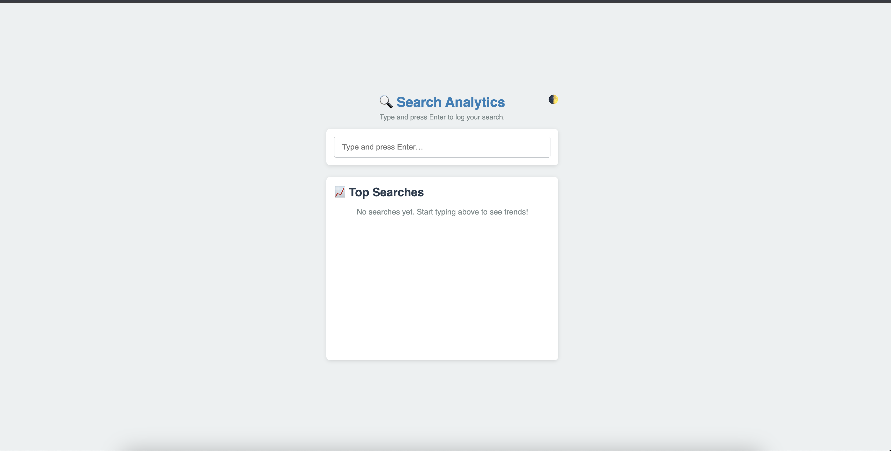

# 🚀 Rose HelpJuice Search

A tiny Rails 8 & vanilla‑JS app that tracks **completed**, real‑time searches and shows the top queries in both list and bar‑chart form. Whether you’re on **macOS**, **Linux**, or **Windows**, this guide will walk you through getting up and running—from cloning the repo to launching the backend, serving the frontend, and running tests. 
<br><br>




---  
&nbsp;  
<br><br>
# Live Demo
- Deployed https://rose-helpjuice-search-823599067cd0.herokuapp.com/
<br><br>

## 🎯 What This Does

1. **Instant search logging**  
   - Captures only _final_ queries per user/IP within a 5‑minute window  
2. **Per‑user analytics**  
   - Returns top 50 search terms with raw `total` counts and `pct` percentages  
3. **Instant typeahead**  
   - Suggests matching popular searches as you type  
4. **Frontend polish**  
   - Loading spinner, empty‑state message, smooth list animations  
   - Dark‑mode toggle (saved in `localStorage`)  
   - Live bar chart of search counts via Chart.js  
5. **Fully tested**  
   - RSpec model & request specs  

---  
&nbsp;  
<br><br>

## 📋 Prerequisites

| Component         | macOS (Homebrew)                                                   | Ubuntu / Debian                                   | Windows (RubyInstaller / WSL2)                         |
| ----------------- | ------------------------------------------------------------------ | ------------------------------------------------- | ------------------------------------------------------- |
| **Ruby 3.2+**     | `brew install ruby`                                                | `sudo apt install ruby-full`                      | Download from [rubyinstaller.org](https://rubyinstaller.org) or use WSL2 |
| **Rails 8**       | `gem install rails`                                                | `gem install rails`                               | `gem install rails`                                     |
| **PostgreSQL**    | `brew install postgresql && brew services start postgresql`        | `sudo apt install postgresql postgresql-contrib`  | Download from [postgresql.org](https://www.postgresql.org/download/windows/) |
| **Node.js & Yarn**| `brew install node yarn`                                           | `sudo apt install nodejs npm && npm install -g yarn` | Download Node.js (+ npm), then `npm install -g yarn`     |
| **cURL**          | preinstalled                                                       | `sudo apt install curl`                           | preinstalled                                            |

> **Tip:** On Windows, using **WSL2** lets you follow the Ubuntu steps almost exactly.  
<br><br>

---  
&nbsp;  
<br><br>

## 🛠️ Installation & Setup

```bash
# 1. Clone the repo
git clone https://github.com/kivuvarosekivuvan/rose_helpjuice_search.git
cd rose_helpjuice_search

# 2. Install Ruby gems
bundle install

# 3. (Optional) Install JS deps if you modify frontend
yarn install

# 4. Database setup
rails db:create
rails db:migrate
```

---
&nbsp;
<br><br>


## ▶️ Running the Backend

```
rails server
```
By default, the app listens on port 3000.


---
&nbsp;
<br><br>

## 🎨 Serving the Frontend
- Just run this port
```
http://localhost:3000/
```


---
&nbsp;
<br><br>

## ✅ Testing
### 1.**RSpec (backend)**
```
bundle exec rspec
```
All model and request specs should pass.
<br><br>


### 2.**Manual smoke tests**
- **Log a search**
 ```
curl -X POST http://localhost:3000/searches \
  -H "Content-Type: application/json" \
  -d '{"query":"hello world"}'

 ```
 Expect 204 No Content.
 <br><br>


- **Fetch trends**
```
curl http://localhost:3000/analytics/trends
```
Returns JSON of top 50 queries with total and pct(%).


---
&nbsp;
<br><br>


## ⚙️ OS‑Specific Notes
- ### **macOS**
If `bundle install` fails, run:
```
sudo gem install bundler
```
or adjust your Ruby path via Homebrew’s Ruby.


- ### **Linux (Debian/Ubuntu)**
Ensure `libpq-dev` (or `postgresql-server-dev-all`) is installed for the `pg` gem:
```
sudo apt install libpq-dev
```

- ### **Windows**
Use the MSYS2 terminal (via RubyInstaller’s `ridk install`) to build native gems, e.g.:

```
ridk install
gem install pg -- --with-pg-config="C:/Program Files/PostgreSQL/<version>/bin/pg_config.exe"
```

---
&nbsp;
<br><br>

## 🎨 Styling & UX Tips

- CSS lives in public/styles.css. Tweak colors, spacing, or animations!

- Accessibility: add keyboard navigation for the suggestions dropdown.


